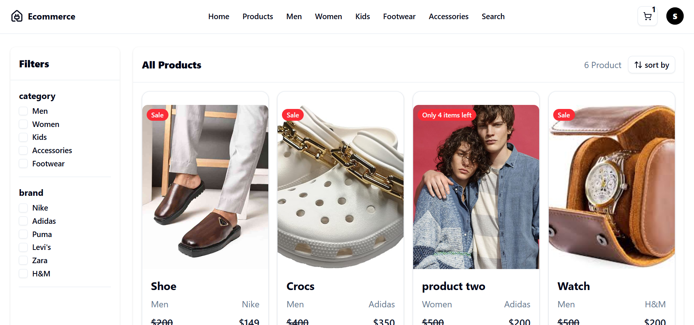
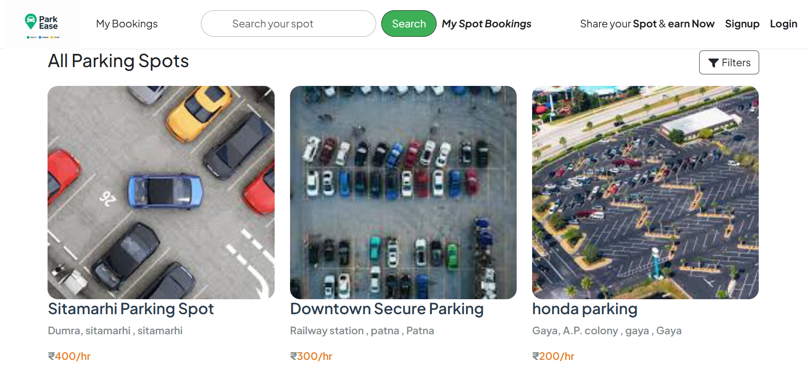
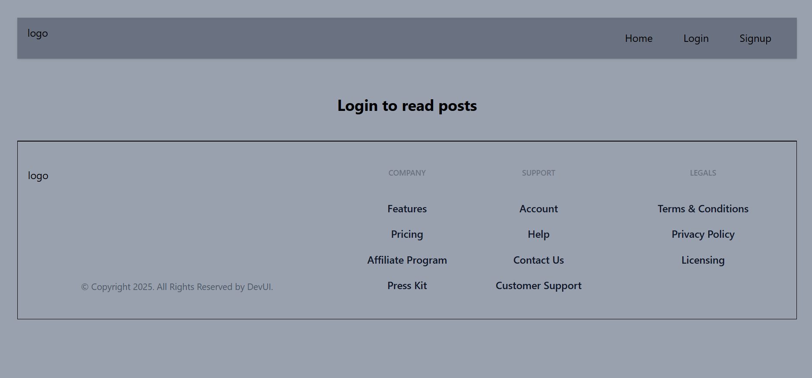

# Hi, I'm Sanjeet Kumar 👋

Full Stack Developer focused on building scalable web applications, AI-powered solutions, and impactful digital products.

🚀 MERN Stack Developer with hands-on experience in designing and deploying end-to-end applications.

💻 Solved 500+ DSA problems and passionate about writing clean, efficient code.

🤖 Exploring Generative AI, Retrieval-Augmented Generation (RAG), LLM applications, and AI-driven user experiences.

🌱 Currently learning System Design, Product Engineering, and scalable software architecture.

🌍 Open to Software Development Opportunities.

## 🛠️ Tech Stack

### Frontend

### Backend

### Database

### AI & Emerging Technologies

### Tools & Platforms

## 🚀 Featured Projects
### 🛒 CartOrbit

  

A full-stack e-commerce platform that delivers a complete online shopping experience with secure authentication, product discovery, order management, and payment integration.

#### ✨ Highlights

- Secure authentication and authorization using JWT
- Advanced product search, filtering, and categorization
- Shopping cart and checkout workflow
- PayPal payment integration
- Admin dashboard for product and order management
- Cloudinary-powered image management

#### 🛠️ Tech Stack

`React.js` `Redux Toolkit` `Node.js` `Express.js` `MongoDB` `Cloudinary` `PayPal`

#### 🔗 Links

- <a href="https://cart-orbit.vercel.app/">🌐 Live Demo</a>
- <a href="https://github.com/Sanjeet1387/cart-orbit-mern">📂 Repository</a>

---

### 🅿️ ParkEase

  

A smart parking management platform that helps users discover, explore, and manage parking spaces through an intuitive and location-aware experience.

#### ✨ Highlights

- Interactive map-based parking discovery
- Location search and geocoding integration
- Dynamic parking listings and filtering
- Secure user authentication
- Responsive design optimized for all devices

#### 🛠️ Tech Stack

`Node.js` `Express.js` `MongoDB` `MapTiler` `Cloudinary` `Bootstrap`

#### 🔗 Links

- <a href="https://parkease-velx.onrender.com">🌐 Live Demo</a>
- <a href="https://github.com/Sanjeet1387/ParkEase">📂 Repository</a>

---

### 📝 Blogify

  

A modern blogging platform that enables users to create, manage, and publish content through a clean and intuitive interface. Built with a focus on content management, authentication, and seamless user experience.

#### ✨ Highlights

- Secure user authentication and authorization
- Create, edit, update, and delete blog posts
- Rich content management workflow
- Image upload and storage integration
- Responsive and user-friendly interface
- Centralized state management for better scalability

#### 🛠️ Tech Stack

`React.js` `Redux Toolkit` `Appwrite` `JavaScript` `HTML5` `CSS3`

#### 🔗 Links

- <a href="https://myblog-app-nu.vercel.app/">🌐 Live Demo</a>
- <a href="https://github.com/Sanjeet1387/MyblogApp">📂 Repository</a>

---
## 🧩 Coding Profiles

- 💻 LeetCode: [https://leetcode.com/u/Sanjeet_kumar4169/]
- 🏆 GeeksforGeeks: [https://www.geeksforgeeks.org/profile/sanjeet159a5]

**Achievements**
- Solved 500+ DSA Problems
- Strong foundation in Data Structures & Algorithms

## 🌐 Connect With Me

- 💼 LinkedIn: [https://www.linkedin.com/in/sanjeet-kumar-y551387/]
- 📧 Email: [sanjeet1252004@gmail.com]

## 📄 Resume

📥 [View Resume](https://drive.google.com/file/d/1d9nht3M1_sUdnr0M6gibSDATYQO_7LZk/view)
